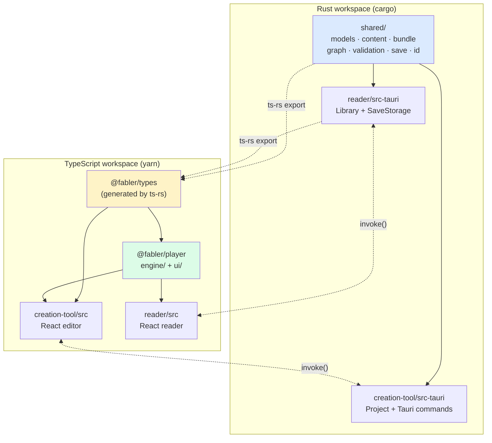
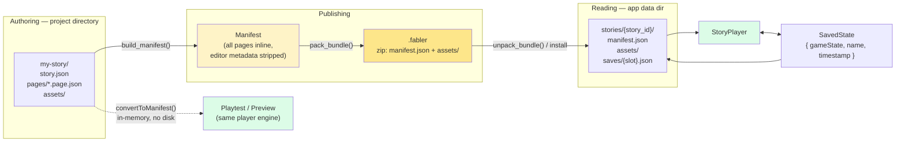
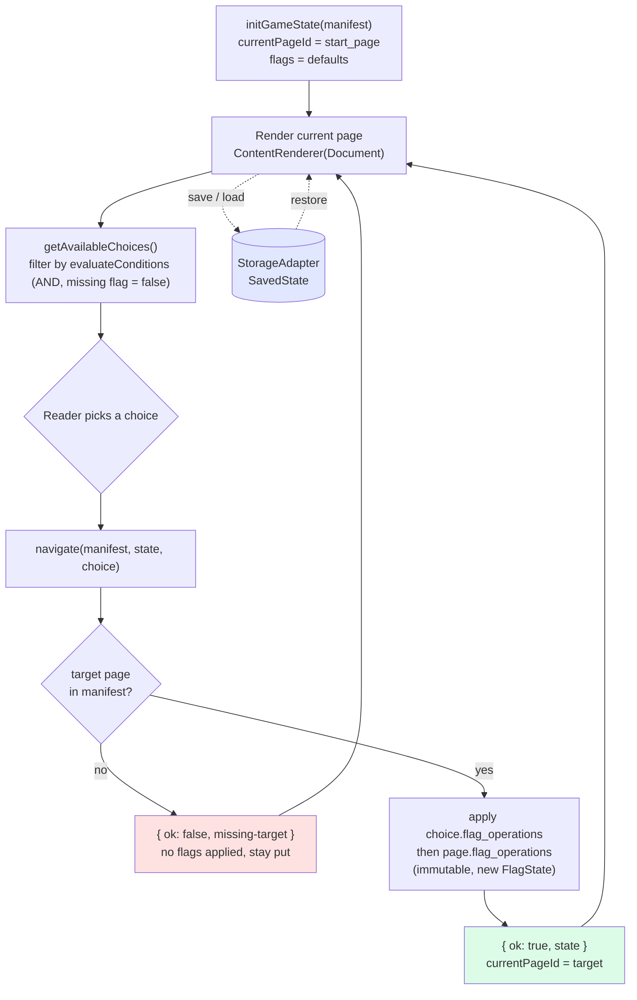
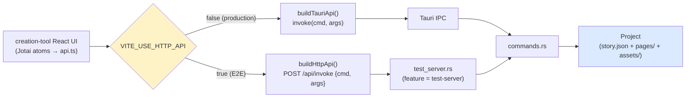

# Fabler Architecture

Two Tauri desktop apps over one Rust core and one shared TypeScript player.
Stories are plain JSON on disk; there is no database and no server.

## The four pieces

| Piece | Language | Role |
|---|---|---|
| `shared/` | Rust | The content model and every operation over it: data types, bundle pack/unpack, validation, graph building, save format. Owns the truth. |
| `types/` (`@fabler/types`) | TypeScript | Generated from `shared/` (plus reader's `library.rs`) by ts-rs. Never hand-written; CI fails if stale. |
| `player/` (`@fabler/player`) | TypeScript | Pure game engine + React UI. Platform-agnostic — talks to the host through two adapter interfaces. |
| `creation-tool/`, `reader/` | Rust + React | The two apps. Each is a thin Tauri shell (`src-tauri/`) plus a React frontend. |



**The load-bearing rule:** Rust defines a type once, ts-rs exports it, both
frontends import it. `yarn codegen` regenerates; `yarn codegen:check` is a CI
gate. There is no hand-written mirror of a Rust type anywhere in the repo.

## Data model

A story is a `Story` (metadata, `start_page`, `flags`) plus a set of `Page`s.
A `Page` has a `Document` body, `choices`, and `flag_operations`.

```
Story ──< Flag
  │
  └──< Page ──< Choice ──< Condition   (flag_id, required_value)
        │        └──────< FlagOperation (set_true | set_false | toggle)
        └──────────────< FlagOperation
```

State is deliberately minimal: **booleans only**. A `GameState` is
`{ currentPageId, flags: Record<string, bool> }` — that is the entire runtime
state, which is why saves are trivial and the engine is pure.

Notable details:

- IDs are 5-char lowercase hex. `Story.id` is the stable identity that survives
  into bundles and keys the reader's installs and save slots.
- Page bodies are a `Document` of `Block`s, but the editor authors exactly one
  `markdown` block. Other block types (`paragraph`, `image`, …) exist for
  bundle manifests only — editing such a page overwrites them.
- `Page.editor` (`EditorMetadata`, currently graph positions) is authoring-only
  and is stripped by `build_manifest`.

## Story lifecycle



Two storage shapes, one content model:

- **Project** — a directory of many small files, optimised for editing and diffs.
- **Manifest** — one self-contained blob with all pages inline, optimised for reading.

Playtest in the creation tool builds a manifest in memory
(`convertToManifest.ts`) and mounts the *same* `StoryPlayer` the reader uses.
There is one renderer and one engine; the editor does not simulate the player.

## Player engine

`player/engine/runtime.ts` is pure functions over `(Manifest, GameState)` — no
React, no I/O, fully unit-testable.



Semantics worth knowing: conditions are AND-ed and a missing flag reads as
`false`; a choice's operations run before the target page's; navigation to a
missing page fails **atomically** (no flags applied, reader stays put) rather
than stranding them on a dead end.

The engine reaches the host only through two interfaces:

- `StorageAdapter` — save/load/list/delete slots
- `AssetResolver` — asset path → URL

The reader implements both over Tauri (`TauriStorageAdapter`,
`TauriAssetResolver` using `convertFileSrc`); the creation tool's playtest uses
an in-memory storage. Porting the player to a new platform means writing two
small classes.

## Creation tool

**Backend.** `Project` owns a story directory and is the only thing that
touches disk. `commands.rs` is a thin `#[tauri::command]` wrapper over it;
`main.rs` registers them. Beyond CRUD, `Project` exposes two derived views,
both computed in `shared/` from the same `(story, pages)` input:

- `validate()` → `Report` of `Problem`s (dangling choice targets, dangling flag
  references, unset/missing start page, unreachable pages). Problems carry
  machine-readable codes and fields — **no prose**; all wording lives in the
  frontend's `i18n/translations.ts`.
- `story_graph()` → `StoryGraph` of nodes and edges for the visual story map.
  Dangling edges are kept and flagged, not dropped — a broken link is exactly
  what the author needs to see.

**Frontend.** Jotai async atoms (`storyAtom`, `pageListAtom`,
`pageAtomFamily`, `validationAtom`) read through `api.ts`; a `refreshAtom`
counter invalidates them after writes. Text never gets hardcoded in components
— it goes through `useTranslation()`.

## Dual-mode API (the testing trick)

`api.ts` has two implementations behind one interface, chosen at build time.
This is what makes the editor E2E-testable in a plain browser, with real Rust
logic and real files, but no Tauri.



The cost: adding a command means touching five places — `Project`,
`commands.rs`, `main.rs`, both branches of `api.ts`, and `test_server.rs`.

## Reader

Smaller by design. `Library` installs `.fabler` bundles into
`{app_data}/stories/{story_id}/`, unzipping the manifest and assets;
`SaveStorage` writes slots as JSON next to them. The frontend is two screens
(library grid, player) plus a responsive nav bar, mounting `StoryPlayer` with
the Tauri adapters.

## Testing

| Layer | Tool | Where |
|---|---|---|
| Rust unit/integration | `cargo test --workspace` | inline `#[cfg(test)]` modules |
| Engine + frontend units | Vitest | `player/engine/__tests__`, `creation-tool/src/**/__tests__` |
| E2E | Playwright | `creation-tool/e2e` (via HTTP test server), `player/e2e` (standalone test app) |
| Type freshness | `yarn codegen:check` | CI gate |

`test-fixtures/` holds two non-interchangeable shapes: single-file **bundle
manifests** for driving the engine directly, and **project directories**
(`lantern-loop/`, the feature-coverage story) for opening in the creation tool.

`yarn verify` runs the whole gate: typecheck, lint, unit, Rust, build.

## Design principles in force

1. **One source of truth for types.** Rust defines, ts-rs generates, TS imports.
2. **Logic in Rust, presentation in TS.** Validation and graph building live in
   `shared/` and return structured data; the frontend supplies wording.
3. **One player, two hosts.** The editor's playtest is not a simulation — it is
   the reader's player with a different manifest source and storage adapter.
4. **Pure engine.** Game logic is side-effect-free functions; all I/O is behind
   adapter interfaces.
5. **Plain files.** JSON on disk, zip for distribution. Nothing to migrate, and
   a story is inspectable with `cat`.
